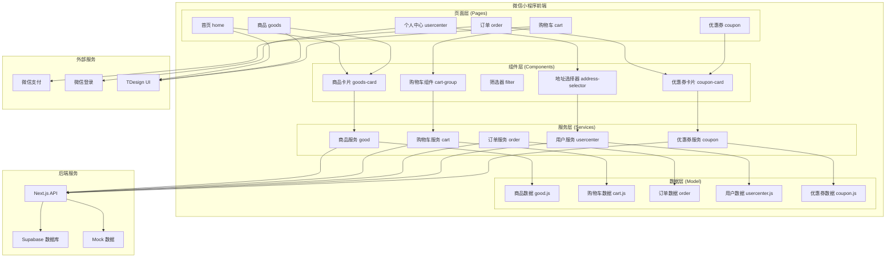
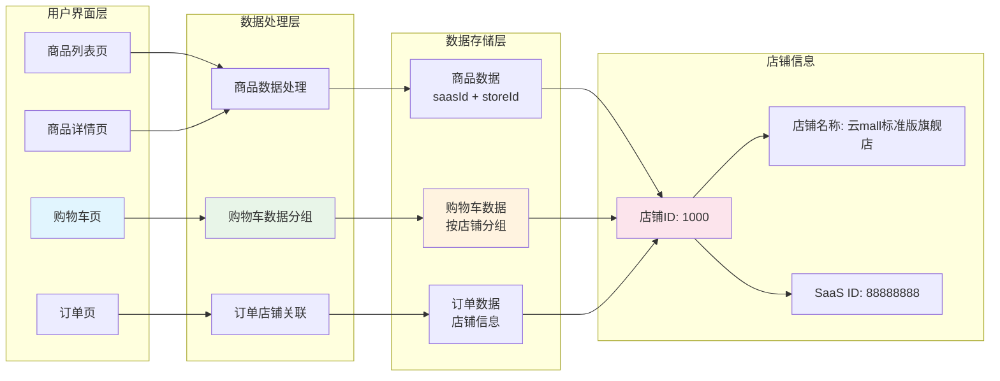

# 前端微信小程序架构文档

## 概述
本项目是基于 TDesign 零售模板构建的微信小程序，采用经典的**单店版电商架构**，涵盖完整的零售黄金链路：商品 → 购物车 → 结算 → 订单。

## 多店铺支持情况

### 🔍 **当前状态：部分支持多店铺**

通过代码分析发现，小程序在数据结构和组件设计上**已具备多店铺基础架构**，但在业务逻辑上主要按**单店铺模式**运行。

#### ✅ **已支持的多店铺特性**：

1. **数据模型支持**：
   - 商品数据包含 `saasId` 和 `storeId` 字段
   - 购物车按店铺分组显示 (`storeGoods`)
   - 订单支持店铺信息 (`storeName`, `storeId`)

2. **购物车多店铺展示**：
   - 购物车页面按店铺分组展示商品
   - 每个店铺可独立选择和操作
   - 支持店铺级别的优惠券

3. **UI组件支持**：
   - 购物车组件支持多店铺布局
   - 商品详情页显示店铺信息

#### ⚠️ **限制和单店铺特性**：

1. **固定店铺信息**：
   - 商品详情页硬编码店铺名称："云mall标准版旗舰店"
   - 缺少店铺选择和切换功能

2. **单一数据源**：
   - 所有商品数据使用相同的 `saasId: '88888888'` 和 `storeId: '1000'`
   - 没有多店铺商品筛选功能

3. **缺少店铺管理**：
   - 无店铺列表页面
   - 无店铺详情页面
   - 无店铺搜索功能

## 技术架构

### 核心技术栈
- **框架**: 微信小程序原生框架
- **UI组件**: TDesign 微信小程序组件库
- **语言**: JavaScript (ES6) + WXSS + WXML
- **构建工具**: 微信开发者工具 + npm
- **代码规范**: ESLint + Prettier

### 项目结构
```
wx-app/
├── app.js                 # 小程序入口文件
├── app.json              # 全局配置
├── app.wxss              # 全局样式
├── components/           # 公共组件库
├── config/               # 基础配置
├── custom-tab-bar/       # 自定义 tabbar
├── model/                # Mock 数据模型
├── pages/                # 页面目录
│   ├── cart/            # 购物车相关页面
│   ├── coupon/          # 优惠券相关页面
│   ├── goods/           # 商品相关页面
│   ├── home/            # 首页
│   ├── order/           # 订单售后相关页面
│   ├── promotion-detail/ # 营销活动页面
│   └── usercenter/      # 个人中心及收货地址
├── services/             # 请求接口服务层
├── style/                # 公共样式与 iconfont
└── utils/                # 工具库
```

## 架构设计图

### 整体架构图

### 多店铺数据流架构图

## 分层架构详解

### 1. 页面层 (Pages)
负责用户界面展示和交互处理，采用微信小程序原生框架。

#### 主要页面模块：
- **首页 (home)**: 商品推荐、轮播图、分类导航
- **商品 (goods)**: 商品列表、详情、搜索、评论
- **购物车 (cart)**: 多店铺购物车管理、结算
- **订单 (order)**: 订单管理、售后服务
- **个人中心 (usercenter)**: 用户信息、地址管理
- **优惠券 (coupon)**: 优惠券领取和使用

### 2. 组件层 (Components)
可复用的UI组件，基于TDesign组件库扩展。

#### 核心组件：
```javascript
components/
├── goods-card/           # 商品卡片组件
├── cart-group/          # 购物车店铺分组组件 ⭐
├── filter/              # 商品筛选组件
├── coupon-card/         # 优惠券卡片组件
├── address-selector/    # 地址选择组件
└── promotion-tag/       # 促销标签组件
```

**多店铺关键组件**：
- `cart-group`: 支持按店铺分组显示购物车商品
- `goods-card`: 显示商品所属店铺信息

### 3. 服务层 (Services)
数据请求和业务逻辑处理层，支持Mock数据和真实API切换。

#### 服务模块：
```javascript
services/
├── good/                # 商品相关服务
├── cart/                # 购物车服务 ⭐
├── order/               # 订单服务
├── usercenter/          # 用户服务
├── coupon/              # 优惠券服务
└── _utils/              # 工具函数
```

**多店铺关键服务**：
- `cart/cart.js`: 购物车数据按店铺分组处理
- `good/fetchGood.js`: 商品数据包含店铺信息

### 4. 数据层 (Model)
Mock数据模型，模拟真实业务数据结构。

#### 数据模型：
```javascript
model/
├── good.js              # 商品数据模型 ⭐
├── cart.js              # 购物车数据模型 ⭐
├── order/               # 订单相关数据
├── usercenter.js        # 用户数据模型
└── coupon.js            # 优惠券数据模型
```

**多店铺数据结构**：
```javascript
// 商品数据包含店铺信息
{
  saasId: '88888888',      // SaaS平台ID
  storeId: '1000',         // 店铺ID
  spuId: '0',              // 商品ID
  title: '商品名称',
  // ...其他字段
}

// 购物车按店铺分组
{
  storeGoods: [
    {
      storeId: '1000',
      storeName: '云Mall深圳旗舰店',
      promotionGoodsList: [/* 商品列表 */]
    }
  ]
}
```

## 技术特性

### 1. 响应式设计
- 适配不同尺寸的手机屏幕
- 支持横竖屏切换
- 基于rpx单位的弹性布局

### 2. 性能优化
- **图片懒加载**: 商品列表图片按需加载
- **分页加载**: 商品列表支持上拉加载更多
- **缓存机制**: 商品详情和用户信息本地缓存
- **代码分包**: 按功能模块分包加载

### 3. 用户体验
- **骨架屏**: 数据加载时显示骨架屏
- **下拉刷新**: 支持下拉刷新数据
- **错误处理**: 网络异常和数据异常友好提示
- **无障碍访问**: 支持读屏软件

### 4. 数据管理
- **状态管理**: 使用小程序原生数据绑定
- **数据持久化**: 关键数据本地存储
- **数据同步**: 支持多端数据同步

## 多店铺升级方案

### 🎯 **升级到完整多店铺版本的建议**

#### 阶段一：基础多店铺支持
1. **店铺管理页面**
   - 新增店铺详情页面

2. **商品页面增强**
   - 商品列表按店铺筛选
   - 商品详情页显示店铺信息
   - 店铺商品推荐

3. **数据结构调整**
   - 支持多店铺商品数据
   - 店铺信息管理
   - 多店铺优惠券

#### 阶段二：高级多店铺功能
1. **店铺运营功能**
   - 店铺关注/收藏
   - 店铺评价系统
   - 店铺活动页面

2. **订单系统增强**
   - 多店铺订单合并/拆分
   - 不同店铺独立配送
   - 店铺客服系统

3. **营销功能**
   - 店铺专属优惠券
   - 跨店铺满减活动
   - 店铺会员体系

#### 阶段三：平台化功能
1. **商家入驻**
   - 商家注册和认证
   - 店铺装修系统
   - 商品管理后台

2. **平台管理**
   - 店铺审核系统
   - 平台佣金结算
   - 数据统计分析

### 📋 **具体实施步骤**

#### 1. 数据模型扩展
```javascript
// 新增店铺数据模型
model/store.js
{
  storeId: '1000',
  storeName: '云Mall深圳旗舰店',
  storeAvatar: 'https://...',
  storeDescription: '店铺描述',
  storeStatus: 1,
  followCount: 1000,
  goodsCount: 500
}
```

#### 2. 页面结构调整
```
pages/
├── store/               # 新增店铺相关页面
│   ├── list/           # 店铺列表
│   ├── detail/         # 店铺详情
│   └── goods/          # 店铺商品列表
├── goods/
│   ├── list/           # 增强：支持店铺筛选
│   └── detail/         # 增强：显示店铺信息
└── cart/               # 已支持多店铺
```

#### 3. 服务层扩展
```javascript
services/
├── store/              # 新增店铺服务
│   ├── fetchStoreList.js
│   ├── fetchStoreDetail.js
│   └── followStore.js
└── good/
    └── fetchGoodsByStore.js  # 按店铺获取商品
```

## 总结

### ✅ **当前优势**
1. **架构清晰**: 分层架构便于维护和扩展
2. **组件化**: 高度组件化，复用性强
3. **多店铺基础**: 数据结构已支持多店铺
4. **用户体验**: 基于TDesign的优秀UI体验

### 🔄 **改进空间**
1. **完善多店铺功能**: 从数据支持升级到完整业务支持
2. **性能优化**: 大数据量下的性能优化
3. **功能扩展**: 增加更多电商功能模块
4. **代码规范**: 统一代码规范和文档

### 🚀 **技术演进方向**
1. **微前端架构**: 考虑拆分为多个独立模块
2. **状态管理**: 引入更强大的状态管理方案
3. **TypeScript**: 逐步迁移到TypeScript
4. **自动化测试**: 建立完善的测试体系

当前架构为**单店铺为主、多店铺为辅**的混合模式，具备升级到完整多店铺平台的良好基础。


        



多店铺架构



333
